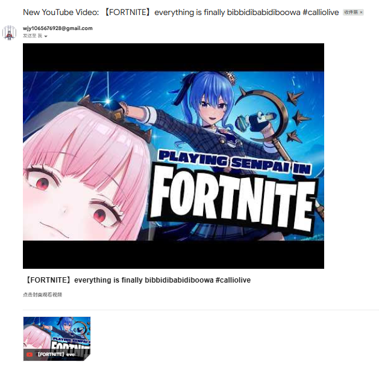

# 最新视频 / Latest Video

🔴 LIVE (title) - [【handcam】arts n crafts with mori calli #calliolive](https://www.youtube.com/watch?v=nzI6EmQNqDE)

---

# Mori-monitor

爱来自AI

这个项目可以将Youtube博主发布最新视频的信息发送到邮箱中

效果：

原理：
1. 获取最新视频
   - 使用 YouTube RSS（https://www.youtube.com/feeds/videos.xml?channel_id=CHANNEL_ID）
   - 解析视频 ID、标题、链接和封面

2. 检测新视频
   - 保存上次发送的视频 ID 到 last_video.txt
   - 只在 RSS 最新视频 ID 与上次不同的时候发送邮件

3. 发送 HTML 邮件
   - 邮件正文显示 视频封面 + 标题
   - 点击封面即可跳转到视频
   - 使用 Gmail SMTP，需要 App Password 登录

4. GitHub Actions 自动化
   - 定时运行 Python 脚本，自动检测并发送邮件
   - Secrets 保存邮箱账号信息，保证安全

所以不止Mori Calliope，你可以fork后自己更改CHANNEL_ID来视奸你喜欢的油管主